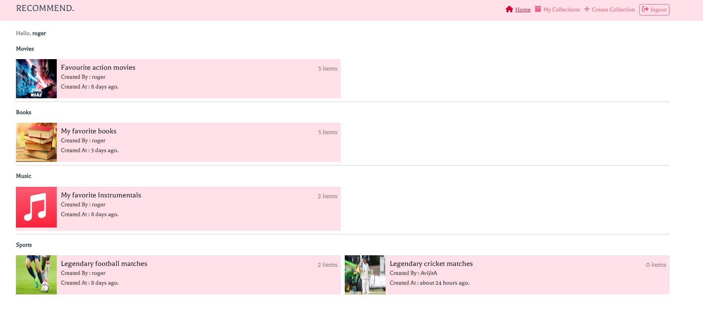
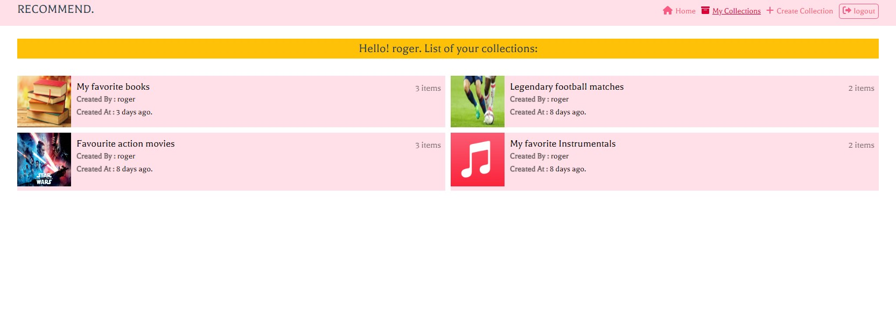
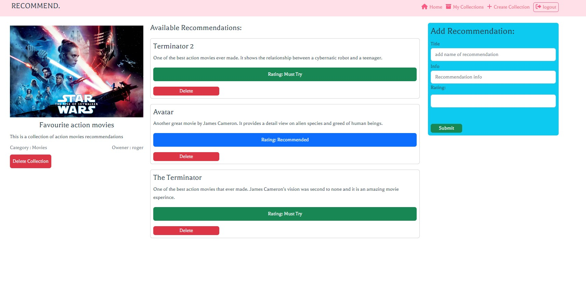
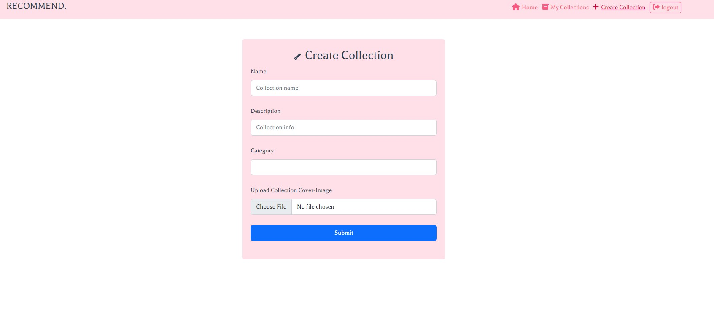

<h1>Recommend.</h1>

This is a fullstack recommendation application. The aim of this project is to provide a platform to users that will allow them to create unique collections of recommendations.






</h1>Additional description about the project and its features.</h1>

<h2>Built With</h2>

- Vue composition api
- Firebase
- Bootstrap
- Firestore
- Vanila javascript

<h2>Getting Started</h2>
To get a local copy up and running follow these simple example steps.

```
- first clone the repository
- use your terminal
- go to the project directory using cd (directory name)
- run "npm install" to install all the dependencies
- run "npm run serve"

```

<h2>Prerequisites for this project</h2>

```
- A good text editor (ex.Vscode)
- Github profile
- Git installed in your local machine
```

<h2>Live Link</h2>

<h2>Authors</h2>

👤 Author1

Github: @ajkacca457

Twitter: @ajkacca

Linkedin: https://www.linkedin.com/in/avijit-karmaker-8738a54a/

<h2> 🤝 Contributing</h2>

Contributions, issues and feature requests are welcome!

Feel free to check the issues page.

Show your support
Give a ⭐️ if you like this project!
